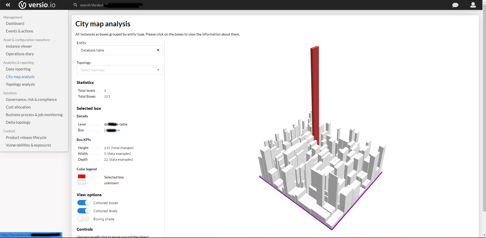

# City map 

The target of the project is to obtain a diagram in the form of a city model in which the boxes (blocks) represent the instances generated in a certain period of time. This type of model will allow visualizing several key figures. 

 

## Technology evaluation

### WebGL

WebGL (short for Web Graphics Library) is a JavaScript API for rendering interactive 2D and 3D graphics within any web browser and without the use of plug-ins.

WebGL is a rasterization engine and runs on the computer's GPU, is a very low-level system that draws points, lines and triangles based on the code provided.

### Three.js

Three.js is a graphics library that makes it easier to achieve 3D content on a web page. Three.js handles scenes, lights, shadows, materials, textures, 3D mathematics, etc.. elements that using WebGL directly would have to be written by the user.

 

# The idea behind city map visualization

Virtualization in the form of a city map is particularly helpful when it is necessary to represent several pieces of information about a very large number of objects. It makes it very easy for the viewer to visually understand the mass of represented objects with their individual characteristics and to recognise special aspects or anomalies in them.

For this purpose, each object is represented on the city map in the form of a house (box). For each house, the four characteristics of the box-like representation can be defined in the form of height, width, depth and colour.

The houses can be grouped on the city map depending on a characteristic comparable to a district (level).

This could be used, for example, to represent thousands of servers of a company with the following properties and groupings:

* Height - Amount of RAM in GByte
* Width - number of CPUs
* Depth - number of network interfaces
* Colour - | grey = internal data centre | blue = Microsoft Azure Cloud | orange = Amazon Web Service |
* Level - Associated cost centre

